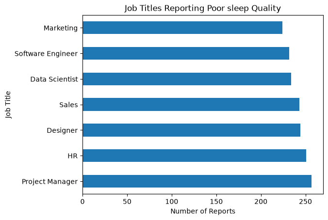
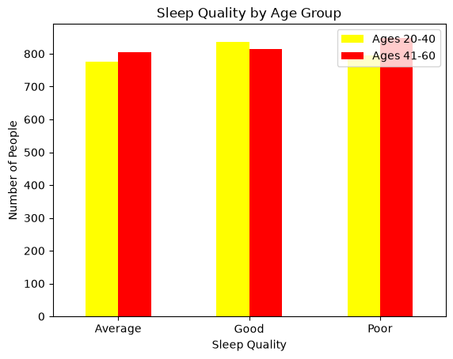
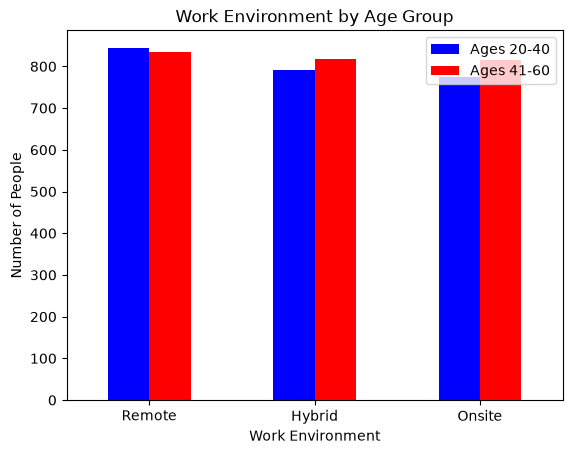
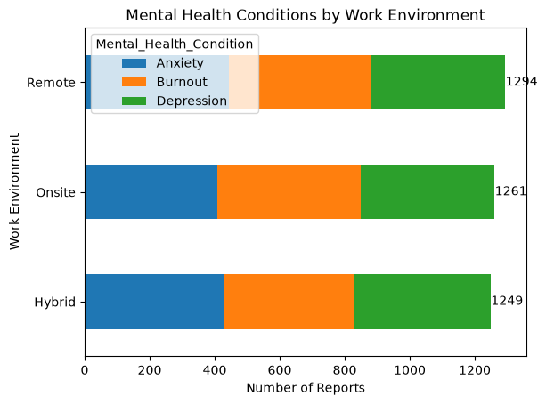

# Work Life Balance
## Description

 

This project analyzes a dataset that explores the work-life balance across different work environments. The dataset includes individuals between the ages of 22 and 60 and explores subjects like work environment, sleep quality, mental health, and overall work-life balance.

## Analysis Questions
- Which occupations report poor sleep quality?
- How does work environment relate to mental health?
- How does age affect these results?
## Tools Used 
- Python
- Pandas
- Matplotlib
- Seaborn
- Jupyter Notebook

## Which Occupations Report Poor Sleep Quality?

## How Does Age Affect These Results?

## How Does Work Environment Relate To Mental Health?

## Findings
After reviewing and cleaning the data, there is not much difference in reported sleep quality across the seven different job titles, with project managers reporting the poorest sleep quality. The data also shows that remote work is the most common work environment for both age groups, but only by a small margin. Workers ages 41–60 had higher numbers of onsite and hybrid workers compared to the younger age group. The data also shows that there is not much difference in reported mental health conditions across the three work environments. Remote workers had the highest number of reports at 1,294, followed by onsite workers at 1,261 and hybrid workers at 1,249. These findings suggest that mental health concerns are present across all work environments.
